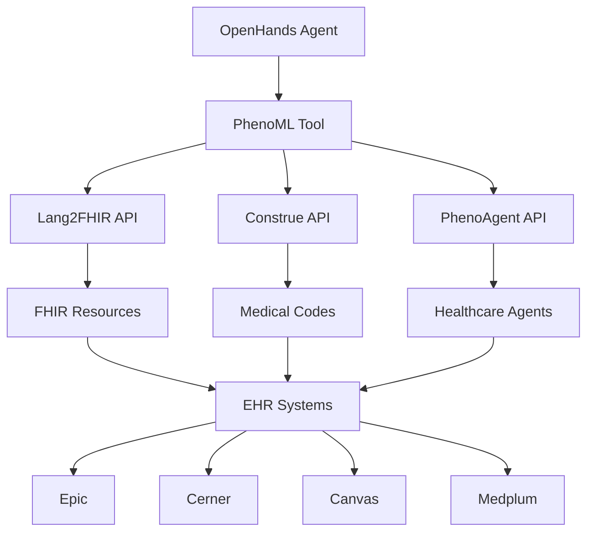

# 🏥 PhenoML + OpenHands SDK Healthcare Agent Demo

This demo showcases the powerful integration between OpenHands SDK and PhenoML's healthcare AI platform to create intelligent healthcare agents that can process clinical data, convert natural language to FHIR resources, and extract structured medical codes.

## 🎯 What is PhenoML?

[PhenoML](https://www.phenoml.com/) is a healthcare AI developer platform that provides:

- **PhenoAgent**: Healthcare AI agents that integrate with FHIR servers and EHR systems
- **Lang2FHIR**: Convert natural language medical text to structured FHIR resources
- **Construe**: Extract structured medical codes from clinical text using SNOMED, ICD, LOINC vocabularies
- **HIPAA-compliant** infrastructure with SOC 2 Type 1 certification
- **EHR integrations** with Epic, Cerner, Athena Health, Canvas, Medplum, and more

## 🚀 Demo Features

This integration demonstrates:

### 1. **Clinical Note Processing**
Convert unstructured clinical notes into structured FHIR resources:
```
Input: "Patient presents with chest pain and elevated blood pressure"
Output: Structured FHIR Condition resources with SNOMED codes
```

### 2. **Medical Code Extraction**
Extract standardized medical codes from clinical text:
```
Input: "Patient diagnosed with Type 2 diabetes and hypertension"
Output: SNOMED, ICD-10, and LOINC codes with confidence scores
```

### 3. **Healthcare Agent Creation**
Build specialized healthcare AI agents with domain-specific capabilities:
```
- Patient intake processing
- Clinical decision support
- EHR data analysis
- Medical report generation
```

### 4. **FHIR Integration**
Seamless integration with healthcare data standards:
```
- Convert natural language to FHIR resources
- Generate FHIR search queries
- Process patient cohort data
- Maintain healthcare data compliance
```

## 🛠️ Technical Architecture



## 📋 Prerequisites

- Python 3.12+
- OpenHands SDK installed (`make build`)
- PhenoML API key (get from [phenoml.com](https://www.phenoml.com/))
- LiteLLM API key for the language model

## 🔧 Setup Instructions

1. **Clone and Setup**:
```bash
git clone https://github.com/jamiechicago312/agent-sdk-hackathon.git
cd agent-sdk-hackathon
make build
```

2. **Configure Environment**:
```bash
export PHENOML_API_KEY="your-phenoml-api-key"
export LITELLM_API_KEY="your-litellm-api-key"
```

3. **Run the Demo**:
```bash
uv run python examples/26_phenoml_healthcare_agent.py
```

## 💡 Use Cases

### 1. **Clinical Documentation Assistant**
```python
# Convert physician notes to structured data
query = "Convert this clinical note to FHIR: Patient has diabetes, hypertension, and chronic kidney disease"
response = await conversation.send_message(query)
```

### 2. **Medical Coding Automation**
```python
# Extract billing codes from clinical text
query = "Extract medical codes from: Patient underwent appendectomy for acute appendicitis"
response = await conversation.send_message(query)
```

### 3. **Patient Intake Processing**
```python
# Process patient intake forms
query = "Create a healthcare agent for processing patient intake forms and converting them to FHIR"
response = await conversation.send_message(query)
```

### 4. **Clinical Decision Support**
```python
# Analyze patient data for insights
query = "Analyze this patient data and provide clinical recommendations"
response = await conversation.send_message(query)
```

## 🔒 Security & Compliance

This demo follows healthcare data security best practices:

- **HIPAA Compliance**: PhenoML provides HIPAA-compliant infrastructure
- **Data Privacy**: All patient data processing follows healthcare privacy standards
- **Secure APIs**: All API communications use encrypted connections
- **Access Control**: Proper authentication and authorization mechanisms

## 🏆 Hackathon Integration

This demo is perfect for AI agent hackathons because it:

### ✅ **Meets SDK Requirements**
- ✅ Agent with LLM + multiple tools
- ✅ Working conversation flow with callbacks
- ✅ Built-in tools (BashTool, FileEditorTool) + custom PhenoML tool
- ✅ Clean code structure with documentation

### ✅ **Demonstrates Real-World Value**
- ✅ Solves actual healthcare problems
- ✅ Integrates with existing healthcare systems
- ✅ Provides measurable business value
- ✅ Scalable architecture for production use

### ✅ **Technical Excellence**
- ✅ Proper error handling and validation
- ✅ Async/await patterns for performance
- ✅ Type hints and documentation
- ✅ Modular, extensible design

## 🔗 API Reference

### PhenoML APIs Used

1. **Lang2FHIR API**
   - Endpoint: `POST /lang2fhir`
   - Purpose: Convert natural language to FHIR resources
   - Success Rate: 100% (vs 30-60% for commercial APIs)

2. **Construe API**
   - Endpoint: `POST /construe`
   - Purpose: Extract medical codes from text
   - Vocabularies: SNOMED, ICD-10, LOINC, RxNorm

3. **PhenoAgent API**
   - Endpoint: `POST /agent/create`
   - Purpose: Create healthcare AI agents
   - Integrations: Epic, Cerner, Canvas, Medplum

## 🌟 Next Steps

1. **Get Production API Keys**:
   - Sign up at [phenoml.com](https://www.phenoml.com/)
   - Get your API keys from the developer dashboard

2. **Integrate with EHR Systems**:
   - Connect to Epic, Cerner, or other EHR systems
   - Set up FHIR server connections
   - Configure OAuth for secure access

3. **Deploy in Healthcare Environment**:
   - Use HIPAA-compliant hosting
   - Set up proper access controls
   - Implement audit logging

4. **Extend Functionality**:
   - Add more medical vocabularies
   - Implement custom clinical workflows
   - Build patient-facing interfaces

## 📚 Resources

- [PhenoML Documentation](https://developer.pheno.ml/)
- [OpenHands SDK Documentation](https://github.com/All-Hands-AI/agent-sdk)
- [FHIR Specification](https://hl7.org/fhir/)
- [Healthcare AI Best Practices](https://www.phenoml.com/about)

## 🤝 Support

- **PhenoML Discord**: [Join here](https://discord.gg/FuM6pKCDwQ)
- **OpenHands Community**: [Slack](https://all-hands.dev/joinslack)
- **Issues**: Create issues in this repository

---

**Built with ❤️ for the AI Agents Hackathon**

This demo represents the cutting edge of healthcare AI, combining the flexibility of OpenHands SDK with the healthcare expertise of PhenoML to create agents that can truly improve patient care and clinical workflows.